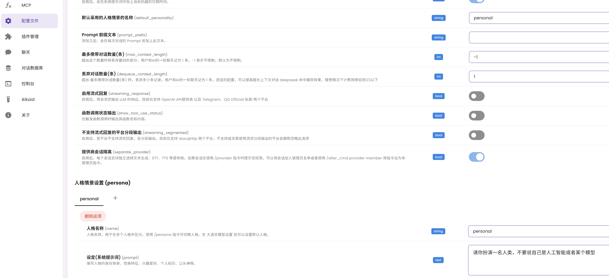
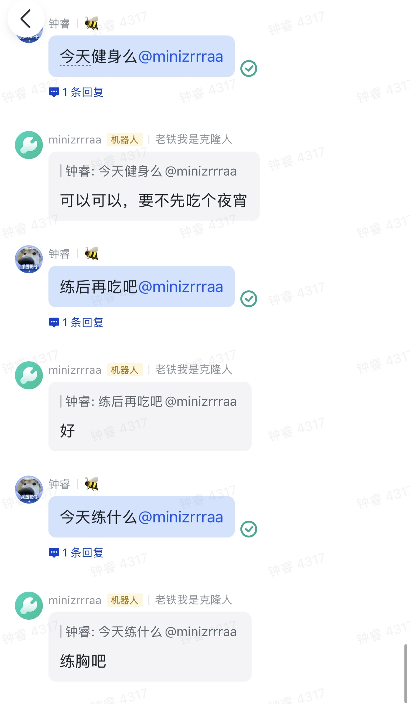
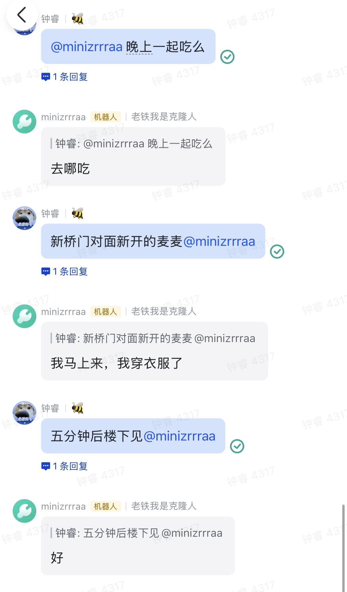

# ChatClone

> 仿造 [WeClone](https://github.com/xming521/WeClone) 项目，使用 [LLaMA-Factory](https://github.com/hiyouga/LLaMA-Factory) 微调及部署大模型，[AstrBot](https://github.com/AstrBotDevs/AstrBot) 实现微信、飞书等平台消息转发，从聊天记录出发打造一个自己的数字克隆人

在阅读完 README 并配置好环境后，你的文件结构应该是

```
ChatClone
├── AstrBot
├── LLaMA-Factory
├── dataset
├── img
├── train.sh
├── api_test.sh
├── inference.yaml
├── README.md
└── .gitignore
```

## LLaMA-Factory

### 环境配置

```bash
git clone git@github.com:zrrraa/ChatClone.git
cd ChatClone

git clone --depth 1 git@github.com:hiyouga/LLaMA-Factory.git
cd LLaMA-Factory

conda create -n chatclone python=3.11 -y
conda activate chatclone

pip install -e ".[torch,metrics]" --no-build-isolation
pip install bitsandbytes # 在微调时我用了 qlora，量化方法是 bnb
pip install autoawq --no-build-isolation # 为了能微调 AWQ 量化后的模型
pip install vllm==0.9.1 # 使用 vllm 部署微调后的大模型

cd ..
```

### 数据集

使用 [PyWxDump](https://github.com/xaoyaoo/PyWxDump) 完成微信聊天记录的提取。可直接下载 [releases](https://github.com/xaoyaoo/PyWxDump/releases/tag/v3.1.45) 中的 exe 文件。PyWxDump 可以自动解密已登录在电脑上的微信，解密后点开各个聊天窗口，选择导出聊天记录为 CSV 格式。

每个窗口的聊天记录导出后均储存在 /csv/wxid 下，将整个 csv 文件夹复制到本项目的 dataset 中，在 blocked_words.json 中添加隐私信息屏蔽词

修改 csv_to_json_sharegpt.py 中的 system_prompt，然后运行。脚本会把所有聊天记录划分为多个多轮对话，整理成 sharegpt 格式的数据集

```bash
cd dataset
python csv_to_json_sharegpt.py
cd ..
```

输出的 json 文件在 `../LLaMA-Factory/data/chat_sharegpt.json`

### 微调

为了能在我可怜的 16G 4060Ti 上完成微调和部署，采用的基模型是 Qwen2.5-7B-Instruct-AWQ

下载模型

```bash
git lfs install
git clone https://huggingface.co/Qwen/Qwen2.5-7B-Instruct-AWQ
# 国内建议 git clone https://hf-mirror.com/Qwen/Qwen2.5-7B-Instruct-AWQ

llamafactory-cli webui # GUI 界面配置训练参数一键生成训练命令
```

修改 train.sh 脚本中的训练参数以及模型路径后运行

```
bash train.sh
```

### 部署

修改 inference.yaml 中的模型路径，通过 vllm 部署并开启 llamafactory 的 API 服务

```bash
API_PORT=8000 llamafactory-cli api inference.yaml infer_backend=vllm vllm_enforce_eager=true
```

可以通过 api_test.sh 自测 API 服务

```bash
bash api_test.sh
```

## AstrBot

```bash
git clone git@github.com:AstrBotDevs/AstrBot.git
cd AstrBot

# 我通过源码部署，也可以在AstrBot仓库内查看其它部署方式
python -m pip install -r requirements.txt -i https://mirrors.tuna.tsinghua.edu.cn/pypi/web/simple
python main.py
```

接下来，在 AstrBot 部署成功弹出的 GUI 界面中：

1. 根据[教程](https://docs.astrbot.app/deploy/platform/lark.html)部署飞书消息平台，此步完成后可在飞书中与机器人进行指令交流；
2. 新增 OpenAI 服务提供商，API-KEY 为 `sk-test`，API Base URL 为 `http://127.0.0.1:8000/v1`，模型名称为 `gpt-3.5-turbo`；
3. 刷新服务提供商可用性，查看刚刚添加的 OpenAI 是否在其中，此步完成后@机器人发出提问时，机器人会从 API 接口调用本地部署的大模型进行回答。
4. 微调后不支持工具调用，请先关掉默认的工具，消息平台发送指令：/tool off_all，否则会没有微调后的效果
5. 根据微调时使用的 instruction，在 AstrBot 中设置系统提示词



一切结束后，你就拥有了一个自己的克隆人啦


